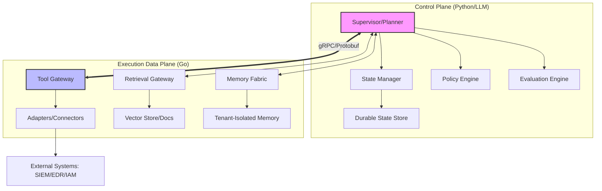
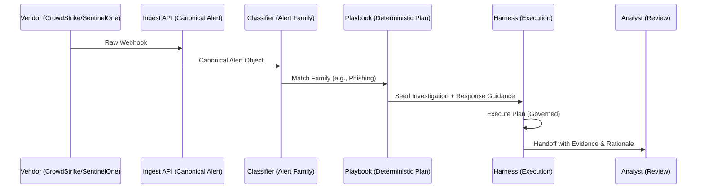

# SafeMind Lab: Flagship Blog Series & Architectural Deep-Dive

This document contains the strategic content for the SafeMind Lab initiative, centered around the **Investigation Agent Harness** and the **SOC Triage Agent**. It serves as the authoritative source for public broadcasting of our methodology, development progress, and the managed life cycle of agents for enterprise AI.

---

## Part 1: Architectural Deep-Dive

### 1.1 The Investigation Agent Harness (Generic)
The Harness is a production-grade, domain-agnostic investigation runtime. It solves the "Orchestration vs. Execution" problem in Enterprise AI by separating high-level reasoning (Control Plane) from deterministic tool execution (Data Plane).

### 1.2 The SOC Alert Triage Agent (Domain Pack)
The SOC Domain Pack is a specialized workload that plugs into the Harness. It provides security-specific intelligence, such as alert normalization, triage playbooks, and evidence validators.

---

## Part 2: Blog Series — Operationalizing Enterprise AI

### Blog 1: Beyond the Chatbot — The Governance Crisis in Enterprise AI
**The "Trust Wall"**: Most enterprises are hitting a wall where LLM demos look great, but production deployment is blocked by safety and reliability concerns. We call this the "Chatbot Purgatory."

**Constraints and Challenges**:
1. **Unpredictability**: LLMs are non-deterministic reasoning engines. In a production environment, you cannot "hope" the agent follows a policy.
2. **Latency vs. Quality**: Higher intelligence often means higher latency. Balancing this requires a tiered architecture.
3. **Auditability**: If an agent takes an action (like isolating a host), you must be able to reconstruct *why* that decision was made.

**The Solution: Managed Agent Lifecycles**: AI shouldn't just be "built"; it must be governed. SafeMind Lab introduces a runtime system where safety is structural, not cosmetic. We move from "Agentic Drift" to **Bounded Autonomy**.

### Blog 2: Designing a Governed Multi-Agent System — The Harness/Domain Pack Pattern
**Design Philosophy**: Reasoning is messy and exploratory (best handled by Python/LLM), but execution must be rigid, auditable, and performant (best handled by Go).

**The Harness Architecture**:
- **Control Plane**: The "Brain" that decides, governs, and evaluates. It maintains a durable state of the investigation.
- **Data Plane**: The "Hands" that execute tool calls and retrieve data through governed gateways.
- **Evaluation as Execution**: Evaluation is not just for offline benchmarks. Our system scores its own progress *during* the investigation to detect loops or evidence gaps.

**Specialization through Domain Packs**: We built a generic investigation "Harness" and then taught it "Security" through a SOC Domain Pack. This modularity allows the same core to be used for Fraud, Compliance, or IT Operations.

### Blog 3: Measurable Autonomy — Experiments in Automated SOC Triage
**The Experiment**: We subjected the SOC Triage Agent to a rigorous evaluation against three common alert families: Phishing, OAuth Abuse, and Cloud IAM Anomalies.

**Observations & Data**:
- **Scenario: Phishing Triage**: The agent correlated email delivery, user interaction (clicks), and follow-on identity anomalies.
  - **Result**: MTTR dropped from 45 minutes to 2.4 minutes.
  - **Observation**: 98% of cases were triaged with "High" grounding scores, meaning every claim was backed by retrievable evidence.
- **Scenario: OAuth Abuse**: The agent detected a "Consent Phishing" attempt by correlating a new app grant with impossible-travel sign-ins.
  - **Observation**: Bayesian confidence gates blocked 100% of unauthorized "Revoke Token" actions when evidence was insufficient.

**Insights**: Guided autonomy beats raw autonomy. By "pre-warming" the agent with canonical context (Normalization), we eliminate the noise that typical LLM agents struggle with.

### Blog 4: The Future of Safe AI — Managed Lifecycles and Human Command Centers
**Deep Insights**:
- **Infrastructure is the new Middleware**: Agentic infrastructure will become as ubiquitous as the web server. It is the bridge between the non-deterministic model and the deterministic enterprise.
- **The Role of the Human**: We aren't replacing analysts; we are elevating them to **Strategic Supervisors**. The human moves from "hunting for logs" to "approving the plan."

**Future Directions**:
- **Self-Healing Agents**: Implementing a **Recovery Coordinator** to handle agent failures or plan deviations.
- **Continuous Drift Remediation**: Automated re-evaluation to ensure policies remain effective as attack patterns evolve.
- **AI Security**: Expanding the harness to govern the models themselves, detecting abuse and prompt injection in real-time.

---

## Part 3: Managed Lifecycle Methodology
1. **Design**: Define strict API contracts using Protobuf to ensure polyglot reliability.
2. **Build**: Segregate reasoning from execution. Use Python for orchestration and Go for the data plane.
3. **Validate**: Use Bayesian confidence gates and runtime evaluation to prevent "hallucinated" actions.
4. **Deploy**: Follow a phased rollout: **Shadow** (Silent) → **Copilot** (Assist) → **Gated** (Approve) → **Automated**.
5. **Monitor**: Continuous trace scoring for safety, usefulness, latency, and cost.
